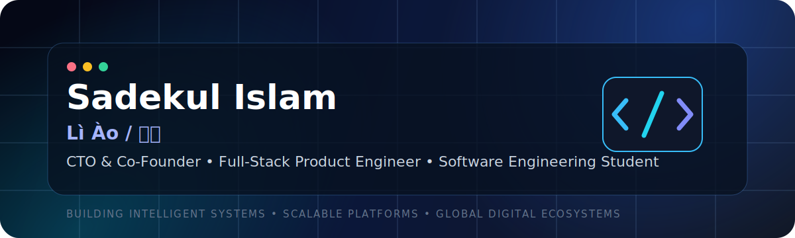

<div align="center">



<br />

# Sadekul Islam (Lì Ào / 利奥)

### Software Engineering Student · CTO & Co-Founder at AnyWin Human Tech Limited · Full-Stack Product Engineer

<p>
  Building AI-powered systems, scalable platforms, multilingual digital ecosystems,<br />
  and technology designed to create meaningful global impact.
</p>

<br />

<a href="https://readme-typing-svg.demolab.com">
  
</a>

<br />

<p>
  <a href="https://sadekulislam.netlify.app">
    
  </a>
  <a href="https://www.linkedin.com/in/sadekulislam-dev">
    
  </a>
  <a href="https://github.com/sadekul-me">
    
  </a>
  <a href="mailto:sadekul.dev@gmail.com">
    
  </a>
</p>

<p>
  
  
  
</p>

</div>

---

## About Me

I am a **Software Engineering student at Wuxi University of Technology, China**, currently serving as **CTO & Co-Founder at AnyWin Human Tech Limited**.

My work focuses on architecting **scalable software systems**, **multilingual platforms**, **AI-powered applications**, and modern digital products that address real-world needs.

I enjoy working at the intersection of:

- Software engineering and system architecture
- Product development and technical strategy
- Artificial intelligence and automation
- Backend scalability and data architecture
- User experience and multilingual digital ecosystems

Alongside building production-focused products, I continuously strengthen my knowledge of **Data Structures & Algorithms, distributed systems, software architecture, backend engineering, and technology leadership**.

> I do not want to build software that merely works. I want to build systems that remain useful, scalable, secure, and meaningful as they grow.

---

## Current Mission

<table>
  <tr>
    <td width="50%" valign="top">
      <h3>Building</h3>
      <ul>
        <li>International-scale digital platforms</li>
        <li>AI-powered applications and knowledge systems</li>
        <li>Multilingual web and mobile ecosystems</li>
        <li>Scalable backend services and APIs</li>
      </ul>
    </td>
    <td width="50%" valign="top">
      <h3>Advancing</h3>
      <ul>
        <li>System Design & Software Architecture</li>
        <li>Data Structures & Algorithms</li>
        <li>Distributed and event-driven systems</li>
        <li>Engineering leadership and product strategy</li>
      </ul>
    </td>
  </tr>
</table>

<div align="center">

### My long-term goal

**To design intelligent software ecosystems and scalable technology platforms that can serve millions of people across languages, cultures, and regions.**

</div>

---

<!-- PHASE 1 COMPLETE
Included:
- Premium hero
- Animated header
- Custom SVG banner
- Social badges
- Visitor counter
- Typing animation
- About Me
- Current Mission
-->


## Engineering Focus

<table>
  <tr>
    <td width="33%" valign="top">
      <h3>Platform Engineering</h3>
      <p>
        Designing product foundations that can evolve from early-stage applications
        into maintainable, scalable, and internationally accessible platforms.
      </p>
      <ul>
        <li>Modular platform architecture</li>
        <li>API-first product development</li>
        <li>Authentication and session systems</li>
        <li>Multi-tenant and multi-city thinking</li>
      </ul>
    </td>
    <td width="33%" valign="top">
      <h3>Product Engineering</h3>
      <p>
        Connecting technical architecture with real user needs, product direction,
        business goals, usability, and long-term maintainability.
      </p>
      <ul>
        <li>Full-stack product execution</li>
        <li>Responsive user experiences</li>
        <li>Cross-platform feature planning</li>
        <li>Product scalability strategy</li>
      </ul>
    </td>
    <td width="33%" valign="top">
      <h3>Intelligent Systems</h3>
      <p>
        Exploring how AI, automation, multilingual knowledge, and structured data
        can create more capable and useful software products.
      </p>
      <ul>
        <li>AI-assisted workflows</li>
        <li>Knowledge-based applications</li>
        <li>Automation pipelines</li>
        <li>Context-aware user experiences</li>
      </ul>
    </td>
  </tr>
</table>

---

## Advanced Technology Stack

<div align="center">

### Languages


<br /><br />


### Frontend Engineering


<br /><br />


### Backend Engineering


<br /><br />


### Database, Cloud & Infrastructure


<br /><br />


### Mobile Engineering


<br /><br />


### Tools & Product Workflow


</div>

---

## Architecture Skills

<table>
  <tr>
    <td width="50%" valign="top">
      <h3>System Architecture</h3>
      <ul>
        <li>Layered and modular architecture</li>
        <li>Domain-oriented backend organization</li>
        <li>Service boundaries and ownership</li>
        <li>Event-driven system thinking</li>
        <li>Scalability and maintainability planning</li>
        <li>Web, mobile, API, and worker coordination</li>
      </ul>
    </td>
    <td width="50%" valign="top">
      <h3>Backend Architecture</h3>
      <ul>
        <li>Authentication and authorization flows</li>
        <li>Session management and identity systems</li>
        <li>Database schema and data-access design</li>
        <li>API contracts and validation strategy</li>
        <li>Background jobs and asynchronous workflows</li>
        <li>Caching, queues, and operational reliability</li>
      </ul>
    </td>
  </tr>
  <tr>
    <td width="50%" valign="top">
      <h3>Platform Scalability</h3>
      <ul>
        <li>Multi-language platform architecture</li>
        <li>Multi-region and multi-city expansion planning</li>
        <li>Separation of product and infrastructure concerns</li>
        <li>Performance-aware data and API design</li>
        <li>Cloud storage and deployment strategy</li>
        <li>Long-term technical roadmap development</li>
      </ul>
    </td>
    <td width="50%" valign="top">
      <h3>Engineering Quality</h3>
      <ul>
        <li>Type-safe application development</li>
        <li>Reusable packages and shared contracts</li>
        <li>Error handling and validation systems</li>
        <li>Observability and structured logging awareness</li>
        <li>Security-conscious architecture decisions</li>
        <li>Production-focused development practices</li>
      </ul>
    </td>
  </tr>
</table>

<div align="center">

> Architecture is not only about making a system work today.  
> It is about making growth, change, and collaboration possible tomorrow.

</div>

---

## AI & Automation Skills

<table>
  <tr>
    <td width="33%" valign="top">
      <h3>AI Integration</h3>
      <ul>
        <li>OpenAI API integration</li>
        <li>AI-assisted application features</li>
        <li>Prompt engineering</li>
        <li>Structured model inputs and outputs</li>
        <li>Context-aware interaction design</li>
      </ul>
    </td>
    <td width="33%" valign="top">
      <h3>Knowledge Systems</h3>
      <ul>
        <li>AI-powered information experiences</li>
        <li>Multilingual content workflows</li>
        <li>Knowledge organization and retrieval</li>
        <li>Structured information delivery</li>
        <li>User-focused intelligent assistance</li>
      </ul>
    </td>
    <td width="33%" valign="top">
      <h3>Automation</h3>
      <ul>
        <li>Workflow automation concepts</li>
        <li>Task orchestration</li>
        <li>AI-assisted operational workflows</li>
        <li>API-based system integrations</li>
        <li>Human-in-the-loop product design</li>
      </ul>
    </td>
  </tr>
</table>

<div align="center">


</div>

---

## Featured Project

<div align="center">

# InWuxi

### International City Gateway for Wuxi, China


</div>

InWuxi is a multilingual city platform designed to connect international users, organizations, businesses, volunteers, and local services across Wuxi, China.

The platform is being developed as more than a content website. Its long-term direction is a scalable digital ecosystem that can support local discovery, community participation, international services, business connections, and intelligent information experiences.

### Platform Purpose

- Help international residents and visitors understand Wuxi
- Connect users with local services, organizations, and opportunities
- Support multilingual access to important city information
- Create stronger links between international communities and local ecosystems
- Build a foundation for future multi-city expansion

### Supported Languages

<div align="center">


</div>

### My Responsibilities

<table>
  <tr>
    <td width="50%" valign="top">
      <ul>
        <li>Technical vision and platform strategy</li>
        <li>Full-stack architecture design</li>
        <li>Web and mobile ecosystem development</li>
        <li>Authentication and identity architecture</li>
      </ul>
    </td>
    <td width="50%" valign="top">
      <ul>
        <li>Data and API architecture</li>
        <li>AI-powered knowledge systems</li>
        <li>Platform scalability planning</li>
        <li>Future multi-city expansion strategy</li>
      </ul>
    </td>
  </tr>
</table>

### Technology Stack

<div align="center">


<br /><br />


</div>

### Engineering Direction

```text
Multilingual Web Platform
        +
Mobile Application Ecosystem
        +
Authentication & User Systems
        +
AI-Powered Knowledge Layer
        +
Scalable Data & API Architecture
        +
Future Multi-City Expansion
```

---

## Professional Experience

### AnyWin Human Tech Limited

**Chief Technology Officer (CTO) & Co-Founder**

<table>
  <tr>
    <td width="50%" valign="top">
      <ul>
        <li>Engineering leadership</li>
        <li>Product architecture</li>
        <li>Technology strategy</li>
      </ul>
    </td>
    <td width="50%" valign="top">
      <ul>
        <li>System planning</li>
        <li>Technical execution</li>
        <li>Platform scalability</li>
      </ul>
    </td>
  </tr>
</table>

My role combines hands-on engineering with technical leadership. I contribute to product direction, system architecture, platform planning, and the execution of software products across web, mobile, backend, and AI-related initiatives.

---

### InWuxi Platform

**Core Technical Member**

- Full-stack development
- Product engineering
- Platform scalability
- International user systems
- Multilingual platform development
- AI-powered platform solutions

---

### ICT Bangladesh

**Frontend Developer**  
`Jan 2025 – Apr 2025`

- Frontend engineering
- Responsive interface development
- AI-integrated solutions
- Team collaboration
- Product-focused implementation

---

## Education

<table>
  <tr>
    <td width="50%" valign="top">
      <h3>Wuxi University of Technology</h3>
      <p><strong>Bachelor of Software Engineering</strong></p>
      <p><code>2025 — 2029</code></p>
      <p>
        Developing a strong foundation in software engineering, programming,
        system design, algorithms, databases, and modern application development.
      </p>
    </td>
    <td width="50%" valign="top">
      <h3>ICT Bangladesh</h3>
      <p><strong>Software Engineering Program</strong></p>
      <p><code>2024 — 2025</code></p>
      <p>
        Focused on practical software development, frontend engineering,
        responsive systems, team collaboration, and project-based learning.
      </p>
    </td>
  </tr>
</table>

<div align="center">

### Learning Philosophy

**Learn deeply. Build consistently. Take ownership. Improve the system, not only the feature.**

</div>

<!-- PHASE 2 COMPLETE
Included:
- Engineering Focus
- Advanced Tech Stack with icons
- Architecture Skills
- AI & Automation Skills
- Featured Project: InWuxi
- Professional Experience
- Education
-->
